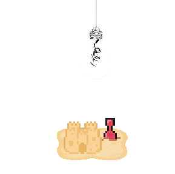

# OmoriSandbox


A battle simulator/sandbox for Omori, written in C# for the Godot engine. It aims to recreate the battle system in the game as accurately as possible, allowing users to create any kind of battle scenario they desire. I started this project in my attempt to learn the Godot engine through recreating a game that I thorougly enjoy.
## Installation
Simply download the latest release archive from the "Releases" section and extract the contents to any folder. The archive should contain two executables:
- `OmoriSandbox.console.exe`: Runs the Sandbox alongside a seperate console window. Useful for viewing debug information and any errors that may occur while using the Sandbox. (Recommended)
- `OmoriSandbox.exe`: Runs just the Sandbox without a console.

## Usage
**Important Note**: As of writing, the project is currently in an "alpha" state, allowing users to try out the sandbox for themselves during active development. While battles are functional from start to finish, __many features including skills, weapons, items, enemies, etc. are missing from the current build.__ Expect bugs, glitches, or potential inaccuracies. See the [To-Dos](#To-Dos) section to see the current status of any missing features. If you happen to find a bug, please report it in the "Issues" tab.

When the Sandbox opens for the first time, it may appear to hang for a couple of seconds. This is **normal** and is simply the Sandbox loading all of its necessary files. After loading, the battle will immediately begin. If you need to restart the fight for any reason, you must fully close and reopen the Sandbox. The "Run" option will not work in any battle and is there for accuracy purposes.

### Configuring the Battle
The battle itself can be configured from the `config.ini` file, usually located at `%appdata%\Godot\app_userdata\OmoriSandbox`. (To access this folder, simply paste the directory into the Windows Run dialog `Windows Key + R`). You can open the config file in any text editor to view and modify it's contents. There is documentation inside the config file explaining each section.

If your config file becomes unfixable or corrupted, simply delete the file, and the Sandbox will generate a default one the next time the Sandbox is launched. By default, the battle will be against Sweetheart, with a full dream world party at level 20 with pre-selected skills and items.

## Customization
The Sandbox currently supports customization via a `custom` folder in the same folder as the aforementioned config file.
A valid file structure would look like so:
```
OmoriSandbox/
| custom/
| |	battlebacks/
| |	bgm/
| config.ini
```
Custom battlebacks should be placed in the `custom/battlebacks` folder, and should be in `.png` format. (640x480 pixels recommended)

Custom BGM should be placed in the `custom/bgm` folder, and should be in `.ogg` format.

You can use custom assets like any other vanilla asset in their respective `config.ini` sections.

As of writing, any other customization, such as custom party members, enemies, items, skills, etc. are not officially supported. The above system will eventually be replaced with official modding in a future release.

## To-Dos
The following features are currently missing and/or not fully functional in the Sandbox, and will be periodically added through updates. This list may shrink or grow at any time depending on updates and bug reports:
### Missing
- [ ] Dots animation on the Energy Bar
- [x] Tier 2 and 3 Followups
- [ ] Omori's special skills (Vertigo, Cripple, Suffocate)
- [ ] Some Screen Tint/Wave Effects
- [ ] Faraway Town Snacks and Toys
- [ ] Sales Tag, Chef's Hat, Contract, Abbi's Eye, Unused Charms
- [ ] In-Battle Dialogue
- [ ] Any skills that perform a Taunt
### Partially Functional
- [ ] Afraid and Stressed Out
- [ ] Party sizes below 4
- [x] Skills that use the `<Not User>` tag
- [ ] Boss-Specific Behavior
- [ ] Game Over
- [ ] Skill/Item descriptions that use character names
### Planned Changes/Additions
- [ ] Official Mod Support/Modding API + Documentation
- [ ] General Refactoring and Code Improvements
- [ ] Porting more enemies and boss fights
- [ ] Title Screen
- [ ] A GUI driven config system

## Contributing
Contributions to the project are welcome! You can help contribute to the project in three main ways:
### Bug Reporting
If you find a bug or issue while using the Sandbox, please open an issue in the **Issues** tab. When opening a new issue, please keep the following in mind:
- Search for any other existing issues that may have already reported the issue you found.
- Please fill out as much as the issue template as you can, including any relevant info and screenshots/video if possible.
- Please be on the lookout for any replies to your issue that may ask for additional information.
- Ensure your issue uses the proper tags.
### Feature Requests
If there is a feature missing or not fully implemented in the Sandbox that is not listed in the **To-Dos** section, feel free to open an issue in the **Issues** tab. Similar to bug reports, please ensure that you use the proper tags and fill out the issue template as much as you can.
### Code Contributions
If you would like to contribute code to the Sandbox, you must first install the latest **.NET Version** of [Godot](https://godotengine.org/download/).

After installation, simply clone the repository and open the project folder in Godot. All of the necessary assets should already be available to you. 

If you need any other assets from the game that the Sandbox currently does not provide, you must retrieve them yourself from a valid copy of Omori.

When you are ready to submit your contribution, please open a pull request in the **Pull Requests** tab with a detailed description of what your PR accomplishes. While any contributions are welcome, PRs that target anything in the **To-Dos** section will most likely take priority. 
Please refrain from modifying anything that impacts the core functionality of the Sandbox, including logos, important filepaths, modifications of vanilla assets, and anything else that negatively impacts the goal of 100% accuracy. Any PRs that are deemed to do so will be rejected.

## Third Party Assets
The assets used by the project were obtained via a legitimate copy of Omori, and are only meant to be used as fair-use and free of charge for this project alone. You may not use the assets contained within this project for any other purpose.
This project is in no way meant to replace the original game, it is for practice, speedrunning, and educational purposes only. It is heavily recommended that you purchase and play through Omori before using this program.
If you are the owner of the aforementioned assets and would like them removed from the repository, please contact me on Discord at `alltoasters` or submit an issue in the **Issues** tab.
