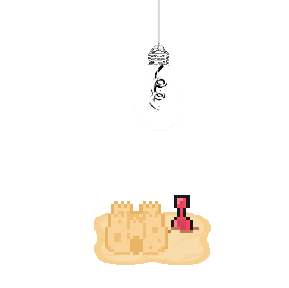

# OmoriSandbox

[Discord](https://discord.gg/3sc4waMg2F)

[Official Documentation](https://ebro912.gitbook.io/omorisandbox) 

A battle simulator/sandbox for _OMORI_, written in C# for the Godot engine. It aims to recreate the battle system from the game as accurately as possible, allowing users to create any kind of battle scenario they desire.

## Installation
Simply download the latest release archive from the "Releases" section and extract the contents to any folder. There are two versions to choose from:
### For Windows Users:
- `OmoriSandbox.zip` uses the Vulkan renderer and works best on newer systems. Recommended for most users.
- `OmoriSandbox_Compat.zip` uses the OpenGL renderer and works best on older systems. Use this if you're having issues with the Vulkan version.

Either archive should contain two executables:
- `OmoriSandbox.console.exe`: Runs the Sandbox alongside a seperate console window. Useful for viewing debug information and any errors that may occur while using the Sandbox. (Recommended)
- `OmoriSandbox.exe`: Runs just the Sandbox without a console.

### For Linux Users
- `OmoriSandbox_Linux.zip` uses the Vulkan renderer and works best on newer systems. Recommended for most users.
- `OmoriSandbox_Linux_Compat.zip` uses the OpenGL renderer and works best on older systems. Use this if you're having issues with the Vulkan version.

To run the Sandbox, you can either use the provided `OmoriSandbox.sh` script, or run the `OmoriSandbox.x86_64` executable directly.

## More Information
You can visit the [Official Documentation](https://ebro912.gitbook.io/omorisandbox) to read more about how the sandbox works, configuration options, important file paths and folders, and modding.

## Modding
As of update v0.8, official modding is now supported! You can read more about creating file driven, JSON, and fully fledged C# mods on the official [Modding Wiki](https://ebro912.gitbook.io/omorisandbox/modding/overview).

If you are looking to port your custom battlebacks and BGM from an older version, you will need to create a basic "mod" in order to load these. This process is very similar to the old `/custom` folder system and requires no coding and minimal JSON configuration. See the above wiki for more info.

**Important Note**
When it comes to loading C# mods, **OmoriSandbox does not perform any kind of sandboxing or malware checking when loading mods**, meaning a malicious actor can create a mod that may harm your system. When using C#/`.dll` driven mods, ensure that you trust the author. You can use a program such as [dnSpy](https://github.com/dnSpy/dnSpy) or [VirusTotal](https://www.virustotal.com/gui/) in order to read the mod code or check the file for viruses before loading it into OmoriSandbox.

## Contributing
Contributions to the project are welcome! You can help contribute to the project in three main ways:
### Bug Reporting
If you find a bug or issue while using the Sandbox, please open an issue in the **Issues** tab. When opening a new issue, please keep the following in mind:
- Search for any other existing issues that may have already reported the issue you found.
- Please fill out as much as the issue template as you can, including any relevant info and screenshots/video if possible.
- Please be on the lookout for any replies to your issue that may ask for additional information.
- Ensure your issue uses the proper tags.
### Feature Requests
If there is a feature missing or not fully implemented in the Sandbox that is not listed in the **To-Dos** section, feel free to open an issue in the **Issues** tab. Similar to bug reports, please ensure that you use the proper tags and fill out the issue template as much as you can.
### Code Contributions
If you would like to contribute code to the Sandbox, you must first install the latest **.NET Version** of [Godot](https://godotengine.org/download/).

After installation, simply clone the repository and open the project folder in Godot. All of the necessary assets should already be available to you. 

If you need any other assets from the game that the Sandbox currently does not provide, you must retrieve them yourself from a valid copy of Omori.

When you are ready to submit your contribution, please open a pull request in the **Pull Requests** tab with a detailed description of what your PR accomplishes. While any contributions are welcome, PRs that target anything in the **To-Dos** section will most likely take priority. 
Please refrain from modifying anything that impacts the core functionality of the Sandbox, including logos, important filepaths, modifications of vanilla assets, and anything else that negatively impacts the goal of 100% accuracy. Any PRs that are deemed to do so will be rejected.

## Third Party Assets
The assets used by the project were obtained via a legitimate copy of Omori, and are only meant to be used as fair-use and free of charge for this project alone. You may not use the assets contained within this project for any other purpose.
This project is in no way meant to replace the original game, it is for practice, speedrunning, and educational purposes only. It is heavily recommended that you purchase and play through Omori before using this program.
If you are the owner of the aforementioned assets and would like them removed from the repository, please contact me on Discord at `alltoasters` or submit an issue in the **Issues** tab.
